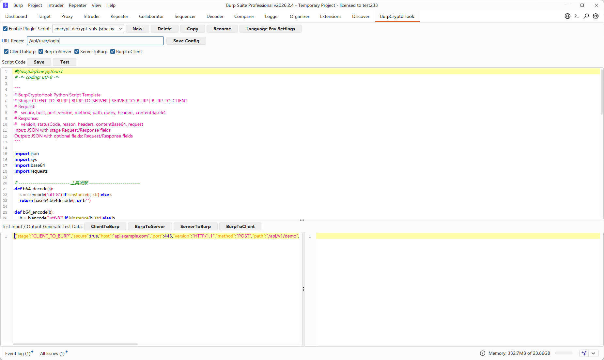
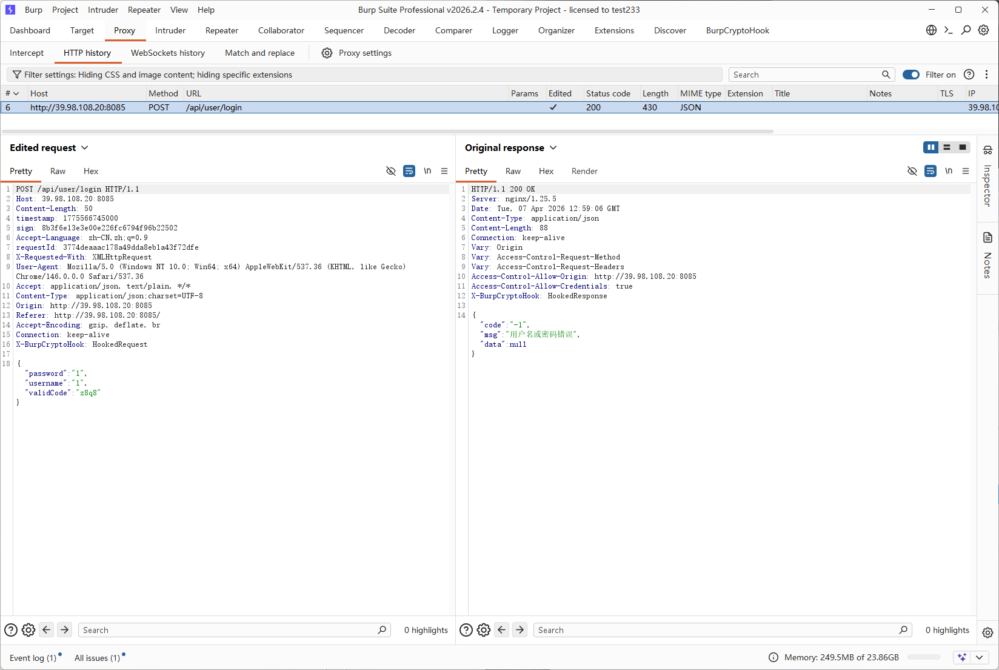
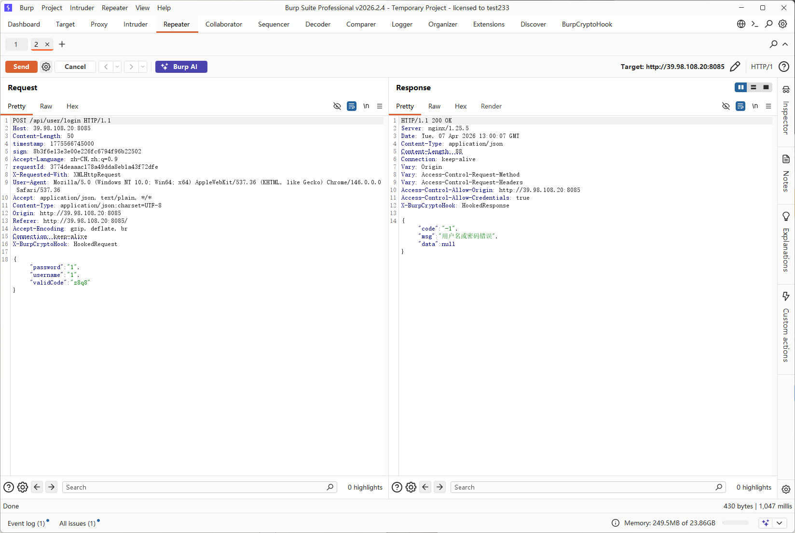
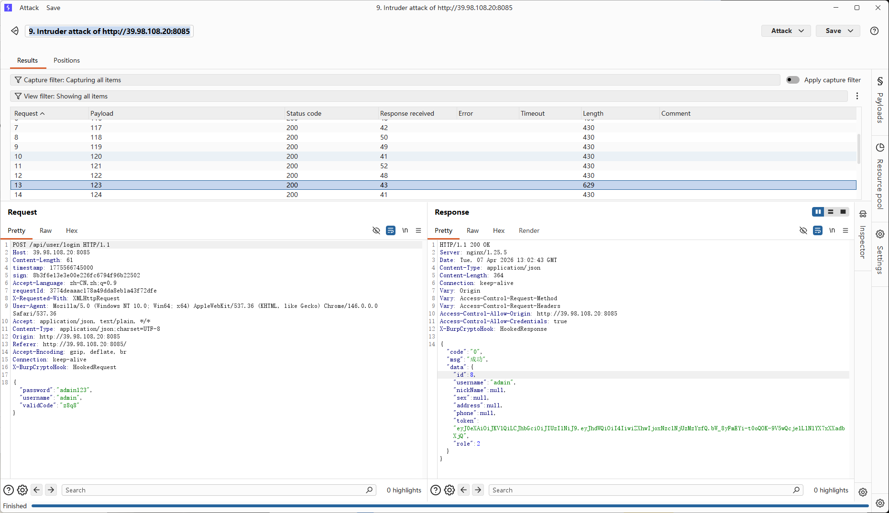

# BurpCryptoHook

一个面向 HTTP 加密流量的 Burp Suite 插件，通过编写加解密脚本实现自动化解密/加密 HTTP 请求与响应。

## 功能特性

- **自动化加解密**：编写脚本后，插件自动解密/加密经过代理的流量

- **脚本驱动**：通过 调用Python/Node.js 脚本实现加解密逻辑，灵活可扩展

- **多阶段 Hook**：支持在 HTTP 生命周期的四个阶段进行加解密

- **多语言支持**：Python 和 Node.js 双引擎

- **内置示例**：提供 30+ 常用加解密算法脚本模板








## 安装


### 版本要求

- Burp Suite Professional v2023.10.3.7+
- JDK 17+

### 安装步骤

1. 下载最新版本的 JAR 文件
2. Burp Suite -> Extender -> Extensions -> Add
3. 选择 JAR 文件 -> Next
4. 插件加载成功后，会在 `~/.burpCryptoHook/` 目录下释放配置文件和示例脚本

## 快速开始

### 1. 配置脚本路径

首次使用需要配置脚本解释器路径：

1. 打开 BurpCryptoHook 面板
2. 设置 `Python Path`（如 `python3`）或 `Node Path`（如 `node`）
3. 如果使用 Node.js 第三方库，设置 `Node Modules Path`（如 `node_modules`）

### 2. 创建或选择脚本

插件自带 30+ 加解密脚本模板，位于 `~/.burpCryptoHook/scripts/`：

```bash
~/.burpCryptoHook/scripts/
├── python/          # Python 脚本
│   ├── aes_cbc.py
│   ├── aes_gcm.py
│   ├── des_cbc.py
│   ├── rsa.py
│   ├── sm2.py
│   ├── sm4.py
│   └── ...
└── javascript/      # Node.js 脚本
    ├── aes_cbc.js
    ├── aes_gcm.js
    ├── rsa.js
    ├── sm4-sm-crypto.js
    └── ...
```

### 3. 配置加密脚本

在插件面板中：

1. 选择要使用的脚本
2. 修改脚本中的密钥和向量配置
3. 设置 URL 正则匹配规则（决定哪些请求使用该脚本）

### 4. 启用并测试

1. 勾选 `Enabled` 启用插件
2. 通过代理发送匹配的请求
3. 在 Burp 中查看解密后的明文流量

## 脚本编写规范

### 四个阶段

| 阶段 | 说明 | 用途 |
|------|------|------|
| `CLIENT_TO_BURP` | 客户端请求到达 Burp | 解密请求 |
| `BURP_TO_SERVER` | Burp 发送请求到服务端 | 加密请求 |
| `SERVER_TO_BURP` | 服务端响应到达 Burp | 解密响应 |
| `BURP_TO_CLIENT` | Burp 发送响应到客户端 | 加密响应 |

### 输入数据结构

#### 请求 (Request)

```json
{
  "stage": "CLIENT_TO_BURP",
  "secure": true,
  "host": "api.example.com",
  "port": 443,
  "version": "HTTP/1.1",
  "method": "POST",
  "path": "/api/v1/encrypt",
  "query": {},
  "headers": {
    "Content-Type": ["application/json"],
    "User-Agent": ["Mozilla/5.0..."]
  },
  "contentBase64": "base64 encoded content..."
}
```

#### 响应 (Response)

```json
{
  "stage": "SERVER_TO_BURP",
  "version": "HTTP/1.1",
  "statusCode": 200,
  "reason": "OK",
  "headers": {
    "Content-Type": ["application/json"]
  },
  "contentBase64": "base64 encoded content..."
}
```

## 内置脚本列表

### Python 脚本

| 脚本 | 说明 | 依赖 |
|------|------|------|
| `aes_cbc.py` | AES-CBC 加解密 | `pycryptodome` |
| `aes_ecb.py` | AES-ECB 加解密（仅演示） | `pycryptodome` |
| `aes_gcm.py` | AES-GCM 认证加密 | `pycryptodome` |
| `aes_cbc_form.py` | AES-CBC 表单字段加解密 | `pycryptodome` |
| `aes_cbc_query.py` | AES-CBC URL参数加解密 | `pycryptodome` |
| `des_cbc.py` | DES-CBC 加解密 | `pycryptodome` |
| `des_ecb.py` | DES-ECB 加解密 | `pycryptodome` |
| `des3_cbc.py` | 3DES-CBC 加解密 | `pycryptodome` |
| `des3_ecb.py` | 3DES-ECB 加解密 | `pycryptodome` |
| `rsa.py` | RSA 加解密 | `pycryptodome` |
| `sm4.py` | 国密SM4 加解密 | `gmssl` |
| `sm2.py` | 国密SM2 加解密 | `gmssl` |
| `sm2_sm4.py` | SM2+SM4 混合加解密 | `gmssl` |
| `formdata_aes.py` | FormData AES 加解密 | `pycryptodome` |

### Node.js 脚本

| 脚本 | 说明 | 依赖 |
|------|------|------|
| `aes_cbc.js` | AES-CBC 加解密 | Node.js crypto |
| `aes_ecb.js` | AES-ECB 加解密 | Node.js crypto |
| `aes_gcm.js` | AES-GCM 认证加密 | Node.js crypto |
| `des_cbc.js` | DES-CBC 加解密 | Node.js crypto |
| `des3_cbc.js` | 3DES-CBC 加解密 | Node.js crypto |
| `rsa.js` | RSA 加解密 | Node.js crypto |
| `sm4.js` | 国密SM4 加解密 | Node.js crypto |
| `sm4-sm-crypto.js` | 国密SM4（sm-crypto库） | `sm-crypto` |
| `sm2-sm-crypto.js` | 国密SM2（sm-crypto库） | `sm-crypto` |
| `sm2-sm4-sm-crypto.js` | SM2+SM4 混合 | `sm-crypto` |
| `aes-crypto-js.js` | AES（crypto-js库） | `crypto-js` |
| `des3-crypto-js.js` | DES/3DES（crypto-js库） | `crypto-js` |
| `rsa-jsencrypt.js` | RSA（jsencrypt库） | `jsencrypt` |
| `formdata_aes.js` | FormData 加解密 | Node.js crypto |

## 依赖安装

### Python 依赖

```bash
# 基础加解密
pip install pycryptodome

# 国密算法
pip install gmssl
```

### Node.js 依赖

```bash
# 基础加解密（内置，无需安装）
npm install crypto-js    # AES/DES 等
npm install jsencrypt   # RSA
npm install sm-crypto   # 国密 SM2/SM4
```

## 配置说明

插件首次加载时，会在用户目录创建配置文件：

```
~/.burpCryptoHook/
├── config.yml           # 主配置文件
└── scripts/
    ├── python/         # Python 脚本
    └── javascript/     # Node.js 脚本
```

### config.yml 结构

```yaml
enabled: true
script_name: "aes_cbc.py"
python_path: "python3"
node_path: "node"
node_modules_path: ""
sqlmap_path: "sqlmap"
sqlmap_args: ""
static_extensions: ".css|.js|.jpg|..."
auto_forward_request: false
log_level: "INFO"
scripts:
  aes_cbc:
    name: "aes_cbc.py"
    language: "PYTHON"
    url_regex: ".*"
    hook_client_to_burp: true
    hook_burp_to_server: true
    hook_server_to_burp: true
    hook_burp_to_client: true
```

## 注意事项

1. **URL 匹配**：通过 `url_regex` 设置脚本匹配的 URL，支持正则表达式
2. **阶段控制**：每个脚本可单独控制启用哪些阶段的加解密
3. **密钥安全**：生产环境中请使用安全的密钥管理方案
4. **错误处理**：脚本应做好异常捕获，避免导致请求失败

## 参考项目

- [Galaxy](https://github.com/outlaws-bai/Galaxy) - 一个让你测试加密流量像测试明文一样简单高效的 Burp 插件
